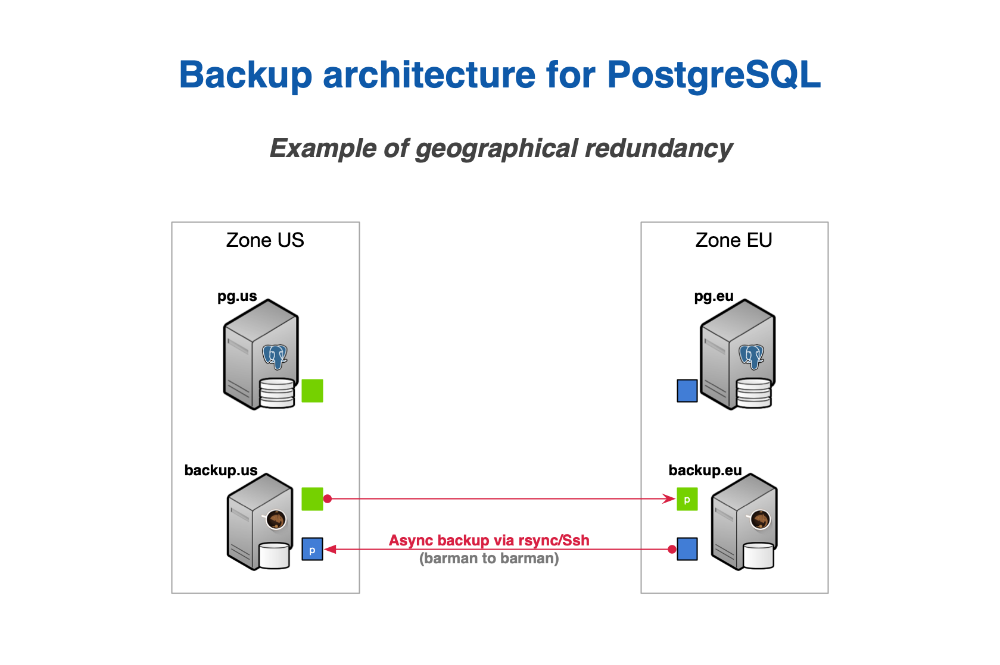
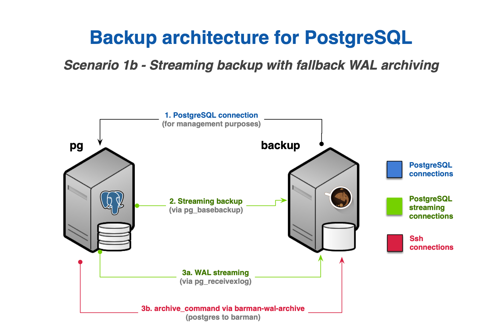
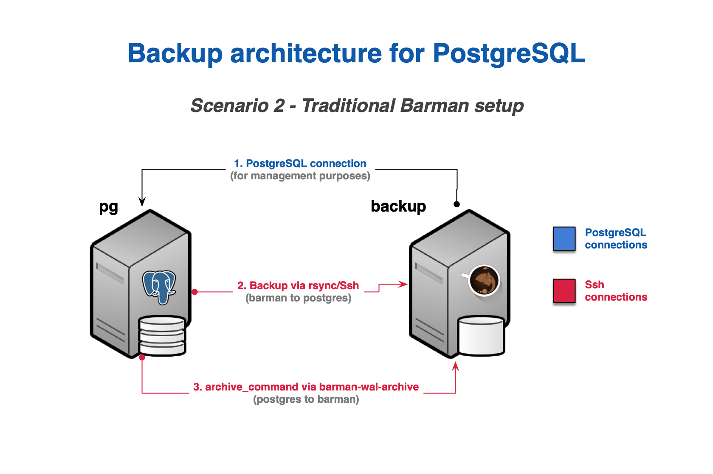

# Architecture 

Barman offers multiple architectural options.  It can operate remotely from a database server via the network.  You could have your Barman server located in the same data center as your PostgreSQL server(s), or in a data center in different region, thousands of miles away from your PostgreSQL server(s). 

!!!recommendation
    Ensure the physical distance between servers allows backup and recovery times to meet your business requirements.

## Design recommendations

Although there isn't a *"one size fits all"* way to configure your Barman architecture, the following recommendations apply:

-   Install Barman on a dedicated server.
-   Don't share the same storage with your PostgreSQL server.
-   Integrate Barman with your monitoring infrastructure.  The [check-barman](https://github.com/hamann/check-barman) command for Nagios is a popular option.
-   Test before deploying to production.
-   Evaluate any single points of failure (SPOF) of your system, and conduct cost-benefit analysis of them.

!!!tip
    A very common setup for Barman is to be installed in the same data center where your PostgreSQL servers are. 
    
    In this case, the single point of failure (SPOF) is the data center. The impact of this SPOF can be alleviated thanks to two features that Barman provides to increase the number of backup tiers:

      1.  **Geographical redundancy** 
      2.  **Hook scripts**

## Geographical redundancy

Geographical redundancy allows a Barman instance that is located in a different data center or availability zone to synchronize the entire content of the source Barman server.  As geographical redundancy can be configured in Barman at the global level and server level, you can create hybrid installations of Barman.  A hybrid installation may have some servers directly connected to your local PostgreSQL servers, and others backing up subsets of different Barman installations (*cross-site backup*). 

This example shows two availability zones, each with a primary PostgreSQL server backed up in a local Barman installation, and relayed on the other Barman server (defined as *passive*) for multi-tier backup via rsync/SSH. 

*An example of architecture with geographical redundancy*

## Multi-server support

Barman supports using multiple servers. It can store backup data coming from multiple PostgreSQL instances, even with different versions, in a centralized manner.  For more information on multiple servers, see [Standby servers](https://www.postgresql.org/docs/current/warm-standby.html#STANDBY-PLANNING) in the PostgreSQL documentation.

Multi-server support allows for complex disaster recovery architectures, forming a "star schema", where multiple PostgreSQL servers rotate around a central Barman server.

!!!important
    From this point forward, for the sake of simplicity, this guide will assume the following basic architecture:

    - A single PostgreSQL instance with a host name of **pg**
    - A single backup server with Barman and a host name of **backup**

## Backup methods

Barman can take backups using the following methods:

- **Rsync**, which uses SSH as a transport mechanism
- **pg_basebackup**, which uses PostgreSQL's streaming replication protocol

!!!recommendation
    Streaming replication is recommended for all currently supported versions of PostgreSQL for the following reasons:

    - Provides a simple setup procedure
    - Supports backups for a PostgreSQL server on Windows *(Windows support for Barman is experimental).*
    - Better integration with Docker

    Backup using **rsync** is recommended in all cases where **pg_basebackup** limitations occur.  For example, **rsync** would be recommended for a very large database that can benefit from incremental backup and deduplication.

## Backup limitations

As Barman transparently makes use of **pg_basebackup**, the following features aren't supported:

- Incremental backup
- Parallel backup
- Deduplication

In this case, bandwidth limitation has some restrictions compared to the traditional method via **rsync**.

## Barman WAL archive

Recovering a PostgreSQL backup relies on replaying transaction logs *(also known as **xlog** or WAL files)*. WAL files stored by Barman must be stored alongside the base backups so that they're available at recovery time. You can use WAL streaming or standard WAL archiving to copy WALs into Barman's WAL archive.

WAL streaming involves streaming WAL files from the PostgreSQL server with **pg_receivewal** using replication slots. WAL streaming is able to reduce the risk of data loss, bringing RPO down to *near zero* values. You can add Barman as a synchronous WAL receiver in your PostgreSQL cluster and achieve **zero data loss** (RPO=0).

Barman supports standard WAL file archiving which is achieved using PostgreSQL's `archive_command`.  The `archive_command` can be used via rsync/SSH, or with the `barman-wal-archive` command. With this method, WAL files are archived only when PostgreSQL switches to a new WAL file. This normally happens for each 16MB worth of data changes.

Either WAL streaming or WAL archiving must be configured. You can configure both WAL streaming and standard WAL archiving.  When both are configured, Barman will automatically de-duplicate incoming WALs. This provides a fallback mechanism so that WALs are still copied to Barman's archive in the event that WAL streaming fails.

!!!recommendation
    For general usage we recommend configuring WAL streaming only.

!!!note
    Previous versions of Barman recommended that both WAL archiving and WAL streaming were used. This was because PostreSQL versions older than 9.4 didn't support replication slots, therefore, WAL streaming alone couldn't guarantee all WALs would be safely stored in Barman's WAL archive. Since all supported versions of PostgreSQL now have replication slots, it's sufficient to configure only WAL streaming.

## Common backup scenarios

Barman has two common backup scenarios:

- Backup via streaming protocol, aka **streaming-only**
- Backup via **rsync/SSH**

!!!recommendation
    Backup via streaming protocol is recommended for most use cases.

You must choose a scenario for every server that you'll back up with Barman. You can have heterogeneous setups within the same installation.  If your architecture contains other technologies such as repmgr, pgBouncer, Nagios/Icinga, etc..., then you should account for those in your chosen scenario.

### Backup via streaming protocol, aka **streaming-only**

*Backup scenario 1a: streaming-only*

#### Requirements

For the **streaming-only** scenario, you must configure:

1.  A standard connection to PostgreSQL, for management, coordination, and monitoring purposes
2.  A streaming replication connection that will be used by both **pg_basebackup** for base backup operations, and **pg_receivewal** for WAL streaming

This scenario doesn't use an SSH connection for backup and archiving operations, which makes it suitable and practical for Docker environments.

### WAL archiving plus streaming

You can configure WAL archiving via SSH in addition to WAL streaming:

*Backup scenario 1b: streaming backup with WAL archiving*

#### Requirements

The following requirements apply to configure WAL archiving via SSH:

-   An additional SSH connection that allows the **postgres** user on the PostgreSQL server to connect as the **barman** user on the Barman server
-   The PostgreSQL `archive_command` must be configured to ship WAL files to Barman.

### Backup via **rsync/SSH**

!!!important
    An rsync/SSH backup installation is required for use cases that need any of the following:

    -   File-level incremental backup
    -   Parallel backup
    -   Finer control of bandwidth usage, including on a per-tablespace basis

*Backup scenario 2a - rsync/SSH*

#### Requirements

For the **rsync/SSH** scenario, you must configure:

1.  A standard connection to PostgreSQL for management, coordination, and monitoring purposes
2.  An SSH connection for base backup operations to be used by rsync. The connection must allow the **barman** user on the Barman server to connect as **postgres** user on the PostgreSQL server.
3.  An SSH connection for WAL archiving to be used by the `archive_command` in PostgreSQL and that allows the **postgres** user on the PostgreSQL server to connect as the **barman** user on the Barman server.

### rsync with WAL streaming

As an alternative to configuring WAL archiving in step 3, you can instead configure WAL streaming as described in scenario 1a. This will use a streaming replication connection instead of `archive_command` and can significantly reduce RPO. 

As with scenario 1a, it's also possible to configure both WAL streaming and WAL archiving:

*Backup scenario 2b - rsync/SSH with WAL streaming*

